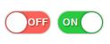

# Z-Switch
Simple & stylish replacement for checkboxes, made with css only.

# [Demo](http://blog.caradeuc.info/z-switch)


# How to

## Installation

```
npm i -S z-switch
```

### Import the css stylesheet 

``` html
// index.html
<link rel="stylesheet" href="node_modules/z-switch/css/z-switch.css">
```

### OR use the sass one

For example, you can include it via the sass includePath option of node-sass

```
// npm scripts
node-sass --include-path="node_modules/z-switch/sass/"  sass/style.sass css/style.css
```

```sass
// style.sass
@import 'z-switch'
```


## The default one : 

The simplest way to use it is with this html structure :

```html
<label class="z-switch">
    // text can go there
    <input type="checkbox">
    <div class="z-switch--container">
        <div class="z-switch--slider"></div>
    </div>
    // text can go there
    Hello, World!
</label>
```


### Default checked ? 

If you want the checkbox to be checked by default, add it the `checked` attribute.


## ON & OFF labels

It is possible to add some text on the switchs to illustrate theire states. (max 3 chars)

For exemple here we will add "ON" & "OFF" labels : 

```html
<label class="z-switch">
    // text can go there
    <input type="checkbox">
    <div class="z-switch--container">
        <div class="z-switch--slider" data-on="ON" data-off="OFF"></div>
    </div>
    // text can go there
</label>
```



## Different sizes

Z-Switchs will always fit the parent font size, but it'zs possible to ask for smaller or bigger ones

2 classes can be added to the z-switch element 

* `z-switch-sm` : smaller one (font-size * 2/3)
* `z-switch-lg` : larger one (font-size * 4/3)


## Different shapes

Z-Switchs are circled by default, you can add these classes to change the shape :

* `z-switch-square`


* `z-switch-tictac`


## Different colors


### The classes way

Two alternative colors are available for the switches, you can use it by adding classes 

* `z-switch-color1`


* `z-switch-color2`


### The sass way

You can override the sass variables to change the switches colors, default ones are : 

```sass
// default colors
$z-switch-off    : #FF6059
$z-switch-on     : #2ACB41
$z-switch-slider : #FEFEFE
$z-switch-text   : #FEFEFE

// color1 alternative
$z-switch-color1-off    : #CCCCCC
$z-switch-color1-on     : #03A9F4
$z-switch-color1-slider : #F4F4F4

// color2 alternative
$z-switch-color2-off    : #454846
$z-switch-color2-on     : #454846
$z-switch-color2-slider : #B4B6B5
```
Here is an example with custom colors :

```sass
$z-switch-off    : #ffbb59
$z-switch-on     : #cb2aaa
$z-switch-slider : #3ed421
```


## Disabled

When the checkbox is disabled, switches will become transparent and no action is possible on it:

